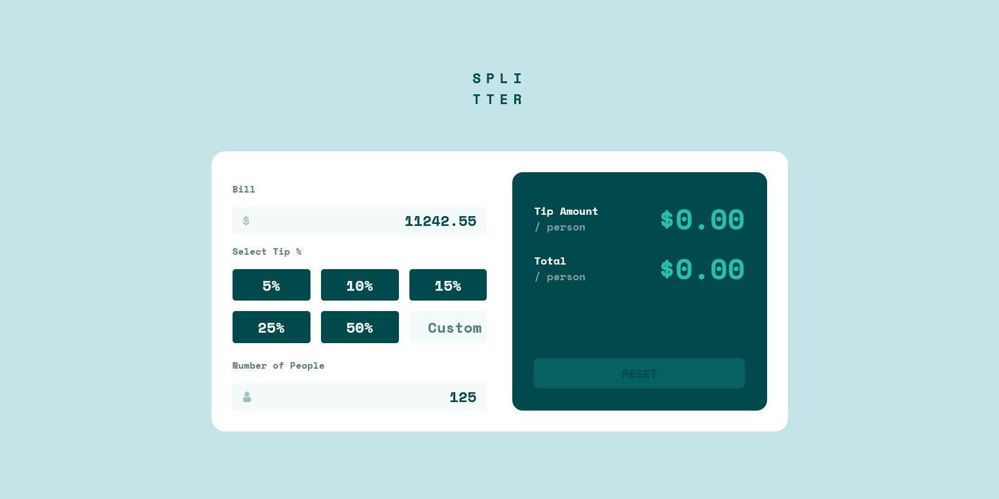
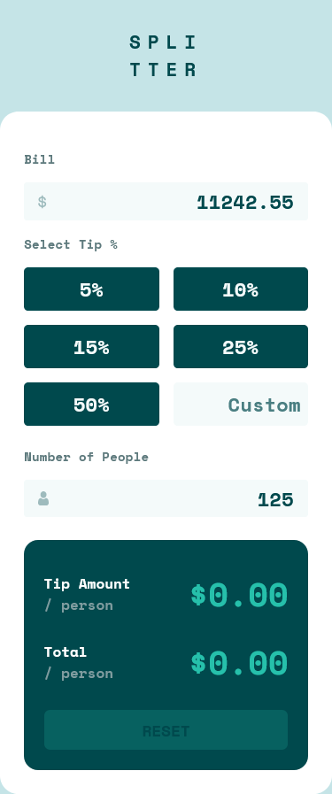

# Frontend Mentor - Tip calculator app solution

This is a solution to the [Tip calculator app challenge on Frontend Mentor](https://www.frontendmentor.io/challenges/tip-calculator-app-ugJNGbJUX). Frontend Mentor challenges help you improve your coding skills by building realistic projects.

## Table of contents

- [Overview](#overview)
  - [The challenge](#the-challenge)
  - [Screenshot](#screenshot)
  - [Links](#links)
- [My process](#my-process)
  - [Built with](#built-with)
  - [What I learned](#what-i-learned)
  - [Continued development](#continued-development)
- [Author](#author)

## Overview

### The challenge

Users should be able to:

- View the optimal layout for the app depending on their device's screen size
- See hover states for all interactive elements on the page
- Calculate the correct tip and total cost of the bill per person

### Screenshot

#### Dekstop



#### Mobile



### Links

- Solution URL: [Front End Mentor Solution](https://www.frontendmentor.io/solutions/responsive-mobile-first-tip-calculator-app-css-html-vanilla-js-vGHTZkP16)
- Live Site URL: [Live Github Page](https://hanz02.github.io/bill-tip-calculator-app/)

## My process

### Built with

- Semantic HTML5 markup
- CSS custom properties
- Flexbox
- CSS Grid
- Mobile-first workflow

### What I learned

Use this section to recap over some of your major learnings while working through this project. Writing these out and providing code samples of areas you want to highlight is a great way to reinforce your own knowledge.

To see how you can add code snippets, see below:

CSS to: style disabled button and placeholder input text

```css
button:disabled,
button[disabled] {
  opacity: 0.2;
}

#custom_tip::placeholder {
  /* Chrome, Firefox, Opera, Safari 10.1+ */
  color: var(--very-dark-cyan);
  opacity: 0.7; /* Firefox */
}

#custom_tip:-ms-input-placeholder {
  /* Internet Explorer 10-11 */
  color: var(--very-dark-cyan);
}

#custom_tip::-ms-input-placeholder {
  /* Microsoft Edge */
  color: var(--very-dark-cyan);
}
```

JS Sciprt to loop through collection of elements, we can attach event listener on them or manipulate them (add or remove classes, etc)

```js
let clearActiveClasses = function (elements) {
  elements.forEach(function (element) {
    element.closest(".input_icon").classList.remove("active");
  });
};
```

### Continued development

Need to improve skills on and familiarize with Vanilla JS, CSS improvement is still a must to be done.

## Author

- Frontend Mentor - [@hanz02](https://www.frontendmentor.io/profile/hanz02)
- Instagram - [@moyashiii_02](https://www.instagram.com/moyashiii_02)
- Github = [hanz02](https://github.com/hanz02)
